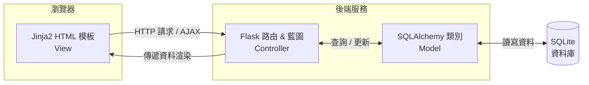
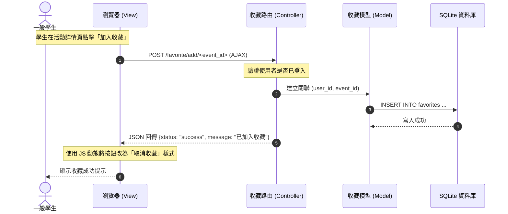
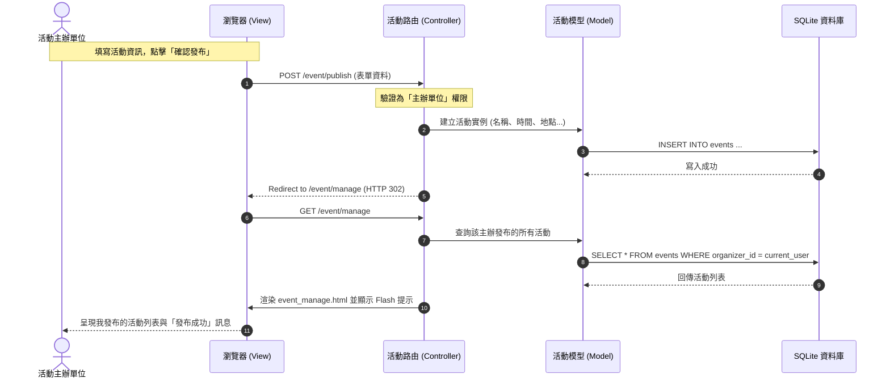

# 系統架構設計文件 (System Architecture)

本文件根據 [PRD.md](file:///Users/wilson/oa3243test/docs/PRD.md) 的需求，規劃「校園活動資訊整合平台」的技術選型、資料夾結構、元件關係以及關鍵設計決策。

---

## 1. 技術架構說明

### 選用技術與原因
*   **後端框架：Python + Flask**
    *   *原因*：Flask 是一個輕量級的微框架，具備極高的靈活性與簡單的學習曲線。非常適合快速迭代 MVP，並能輕鬆整合資料庫與前端模板。
*   **模板引擎：Jinja2**
    *   *原因*：Flask 內建的模板引擎。透過伺服器端渲染 (Server-Side Rendering, SSR)，不需建立複雜的前後端分離 API 結構，能直接在 HTML 中使用 Python 語法（迴圈、條件判斷）動態渲染資料，大幅縮短開發時間。
*   **資料庫與 ORM：SQLite + Flask-SQLAlchemy**
    *   *原因*：SQLite 是一個免設定的檔案型資料庫，非常適合本機開發與小型專案。搭配 Flask-SQLAlchemy (ORM) 可將資料表抽象化為 Python 類別，防範 SQL 注入 (SQL Injection) 攻擊，並簡化多對多關係（如：使用者收藏活動）的查詢。
*   **身分驗證：Flask-Login**
    *   *原因*：提供完善的 Session 管理機制，可方便地透過 `@login_required` 裝飾器保護需要權限的路由，並在模板中輕鬆取得當前登入的使用者資訊。

### Flask MVC 模式說明
本專案採用類似 MVC (Model-View-Controller) 的架構來組織程式碼：



*   **Model (模型)**：定義資料結構與關聯。位於 `app/models/`，負責定義 `User`、`Event` 等資料表，以及欄位型態、主鍵/外鍵關係。
*   **View (視圖)**：呈現使用者介面。位於 `app/templates/`，使用 HTML 與 Jinja2 語法，依據 Controller 傳入的資料動態渲染網頁。
*   **Controller (控制器/路由)**：處理業務邏輯與請求。位於 `app/routes/`，定義 HTTP 路由，接收瀏覽器請求，調用 Model 進行資料存取，最後決定要渲染哪個 View 或進行重導向。

---

## 2. 專案資料夾結構

本專案建議採用以下結構進行開發，以利於模組化分工：

```
oa3243test/
├── app/                        # 應用程式核心目錄
│   ├── __init__.py             # App Factory，初始化套件與註冊藍圖
│   ├── models/                 # 資料庫模型 (Model)
│   │   ├── __init__.py         # 匯出所有 Model
│   │   ├── user.py             # 使用者模型 (一般學生、活動主辦)
│   │   ├── event.py            # 活動模型 (名稱、時間、地點、描述等)
│   │   └── favorite.py         # 收藏關聯 (學生與活動的多對多關係)
│   ├── routes/                 # 路由與控制器 (Controller)
│   │   ├── __init__.py         # 藍圖定義與匯出
│   │   ├── auth.py             # 註冊、登入、登出功能
│   │   ├── main.py             # 首頁、活動搜尋篩選與詳情瀏覽
│   │   ├── event.py            # 活動發布、編輯與下架刪除 【主分工】
│   │   └── favorite.py         # 新增/取消收藏與我的收藏清單 【主分工】
│   ├── static/                 # 靜態資源
│   │   ├── css/
│   │   │   └── style.css       # 系統全域與元件樣式表
│   │   └── js/
│   │       └── main.js         # 前端互動邏輯 (如 AJAX 收藏請求)
│   └── templates/              # Jinja2 模板 (View)
│       ├── base.html           # 基礎框架版型 (包含導覽列、頁尾、訊息框)
│       ├── index.html          # 首頁 (活動看板與搜尋列)
│       ├── event_detail.html   # 活動詳細內容頁面
│       ├── login.html          # 登入頁面
│       ├── register.html       # 註冊頁面
│       ├── favorite_list.html  # 我的收藏頁面 【主分工】
│       ├── event_publish.html  # 發布活動表單 【主分工】
│       └── event_manage.html   # 活動管理後台列表 【主分工】
├── docs/                       # 專案文件目錄
│   ├── PRD.md                  # 產品需求文件
│   └── ARCHITECTURE.md         # 系統架構設計文件
├── instance/                   # 執行實例目錄 (不加入 Git 版本控制)
│   └── database.db             # SQLite 資料庫檔案
├── .gitignore                  # Git 忽略設定 (.pyc, instance/, venv/ 等)
├── app.py                      # 應用程式啟動進入點
├── config.py                   # 系統全域組態設定 (密鑰、資料庫路徑等)
└── requirements.txt            # Python 相依套件清單 (Flask, SQLAlchemy 等)
```

---

## 3. 元件關係圖

以下展示使用者在進行主要操作時，元件之間的資料流向：

### 3.1 瀏覽活動與收藏活動流程 (一般學生)



### 3.2 發布與管理活動流程 (活動主辦單位)



---

## 4. 關鍵設計決策

### 決策 1：使用 Flask Blueprint (藍圖) 進行功能模組化
*   **決策內容**：將路由拆分為 `auth`、`main`、`event` 與 `favorite` 四個藍圖，而不是全部寫在單一的 `app.py` 中。
*   **決策原因**：模組化能讓程式碼職責分離，符合單一職責原則。這能讓團隊合作時，不同開發人員修改各自負責的模組路由（如：您負責 `event` 與 `favorite`，夥伴負責 `auth` 與 `main`）而不會產生 Git 衝突，也方便程式碼除錯與維護。

### 決策 2：建立多對多關聯表 `favorites`
*   **決策內容**：在資料庫設計中，使用一個獨立的關聯表 (Association Table) 來連結 `users` 表與 `events` 表，記錄學生收藏的活動。
*   **決策原因**：一位學生可以收藏多個活動，一個活動也可以被多位學生收藏。使用 Flask-SQLAlchemy 的 `db.Table` 定義一個雙向的多對多關聯，可以讓我們在 Python 中直接使用 `user.favorite_events.append(event)` 或 `event.favorited_by.all()`，大幅簡化資料庫查詢。

### 決策 3：實作角色基礎存取控制 (Role-Based Access Control, RBAC)
*   **決策內容**：在 `User` 模型中設計 `role` 欄位（例如：`student` 與 `organizer`），並自訂裝飾器（如 `@organizer_required`）來保護發布與管理活動的路由。
*   **決策原因**：一般學生不應具備發布或編輯活動的權限，以維護平台資訊的正確性。必須在路由層級進行嚴格的權限驗證，避免使用者透過修改瀏覽器 URL 直接進入後台。

### 決策 4：引入 AJAX (Fetch API) 處理收藏互動
*   **決策內容**：學生在列表頁面或詳細頁面點擊收藏/取消收藏時，使用瀏覽器的 `fetch` 發送非同步請求，而非傳統的表單提交。
*   **決策原因**：當使用者在滑動瀏覽長列表時，若每次點擊收藏都需要重新整理整個頁面，會導致瀏覽體驗中斷並消耗多餘流量。使用 AJAX 能夠在不重新載入網頁的前提下，實現流暢的按鈕狀態切換。
