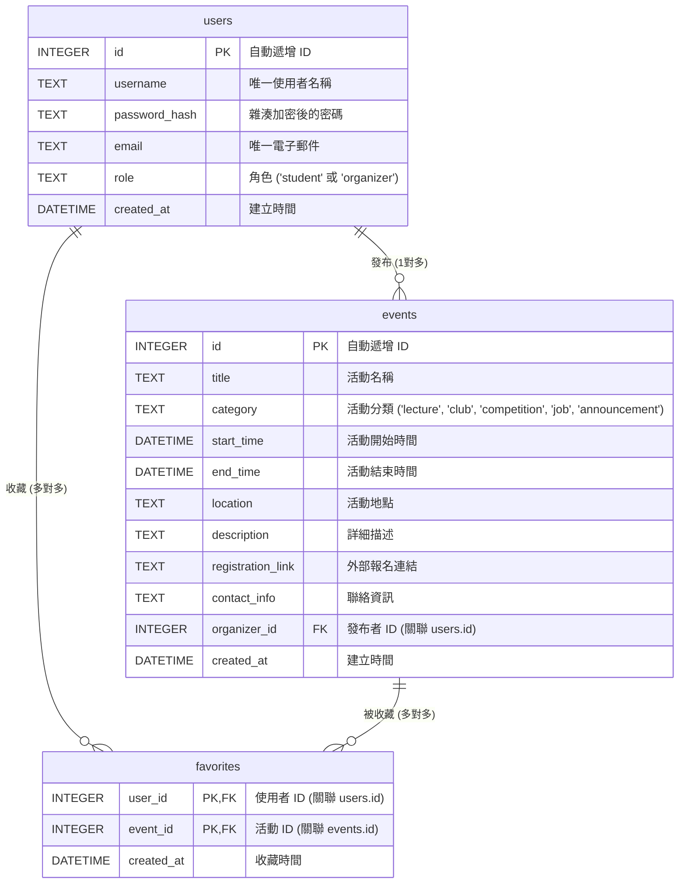

# 資料庫設計文件 (Database Schema Design)

本文件根據 [PRD.md](file:///Users/wilson/oa3243test/docs/PRD.md) 與 [ARCHITECTURE.md](file:///Users/wilson/oa3243test/docs/ARCHITECTURE.md) 的規劃，設計 SQLite 資料表欄位、型別與關聯，並提供 SQL 建表語法與 Python Model 程式碼設計。

---

## 1. 實體關係圖 (ER Diagram)

本系統包含三個核心資料表：`users` (使用者)、`events` (活動) 以及用來記錄學生收藏活動的 `favorites` (多對多關聯表)。

---

## 2. 資料表詳細說明

### 2.1 `users` 資料表 (使用者帳號)
儲存一般學生與活動主辦單位的帳號資訊。

| 欄位名稱 | 資料型別 (SQLite) | 屬性限制 | 說明 |
| :--- | :--- | :--- | :--- |
| `id` | `INTEGER` | `PRIMARY KEY AUTOINCREMENT` | 使用者唯一識別碼。 |
| `username` | `TEXT` | `UNIQUE`, `NOT NULL` | 登入帳號，不可重複。 |
| `password_hash` | `TEXT` | `NOT NULL` | 加密後的密碼欄位。 |
| `email` | `TEXT` | `UNIQUE`, `NOT NULL` | 使用者信箱，主要用於通知與驗證。 |
| `role` | `TEXT` | `NOT NULL` | 使用者角色，僅限 `'student'` (一般學生) 或 `'organizer'` (活動主辦單位)。 |
| `created_at` | `DATETIME` | `DEFAULT CURRENT_TIMESTAMP` | 帳號創立日期與時間。 |

### 2.2 `events` 資料表 (校園活動)
儲存由主辦單位發布的各類校園活動詳細資訊。

| 欄位名稱 | 資料型別 (SQLite) | 屬性限制 | 說明 |
| :--- | :--- | :--- | :--- |
| `id` | `INTEGER` | `PRIMARY KEY AUTOINCREMENT` | 活動唯一識別碼。 |
| `title` | `TEXT` | `NOT NULL` | 活動標題，如「第十屆吉他社成果發表」。 |
| `category` | `TEXT` | `NOT NULL` | 分類：`lecture` (講座), `club` (社團), `competition` (競賽), `job` (工讀), `announcement` (公告)。 |
| `start_time` | `DATETIME` | `NOT NULL` | 活動開始日期與時間。 |
| `end_time` | `DATETIME` | `NOT NULL` | 活動結束日期與時間。 |
| `location` | `TEXT` | `NOT NULL` | 活動舉辦地點，例如「學生活動中心 401」。 |
| `description` | `TEXT` | 允許 `NULL` | 活動內容詳細說明與注意事項。 |
| `registration_link` | `TEXT` | 允許 `NULL` | 外部報名表單（如 Google 表單）的 URL。 |
| `contact_info` | `TEXT` | 允許 `NULL` | 主辦人聯絡電話或 Email。 |
| `organizer_id` | `INTEGER` | `FOREIGN KEY`, `NOT NULL` | 指向發布該活動的主辦單位 `users.id`。 |
| `created_at` | `DATETIME` | `DEFAULT CURRENT_TIMESTAMP` | 活動發布的系統時間。 |

### 2.3 `favorites` 資料表 (活動收藏關係)
建立學生與活動之間的多對多關聯（一位學生可收藏多個活動，一個活動可被多位學生收藏）。

| 欄位名稱 | 資料型別 (SQLite) | 屬性限制 | 說明 |
| :--- | :--- | :--- | :--- |
| `user_id` | `INTEGER` | `PRIMARY KEY`, `FOREIGN KEY` | 指向收藏此活動的學生 `users.id`。 |
| `event_id` | `INTEGER` | `PRIMARY KEY`, `FOREIGN KEY` | 指向被收藏的活動 `events.id`。 |
| `created_at` | `DATETIME` | `DEFAULT CURRENT_TIMESTAMP` | 使用者收藏此活動的時間點。 |

---

## 3. SQL 建表語法

以下為 SQLite 原生建表 SQL，儲存於 [database/schema.sql](file:///Users/wilson/oa3243test/database/schema.sql)。

*   已啟用外鍵約束 (`FOREIGN KEY`)。
*   為 `favorites` 設定複合主鍵 (`PRIMARY KEY (user_id, event_id)`)。
*   對常見查詢欄位建立索引以提升搜尋效能。

---

## 4. Python Model 實作 (SQLAlchemy)

程式碼使用 **Flask-SQLAlchemy**。以下為 Model 目錄的對應檔案設計：
*   [app/models/\_\_init\_\_.py](file:///Users/wilson/oa3243test/app/models/__init__.py): 初始化 `db` 實例與匯出。
*   [app/models/user.py](file:///Users/wilson/oa3243test/app/models/user.py): 包含密碼加密與 CRUD 輔助方法。
*   [app/models/event.py](file:///Users/wilson/oa3243test/app/models/event.py): 包含活動建立、篩選與更新。
*   [app/models/favorite.py](file:///Users/wilson/oa3243test/app/models/favorite.py): 處理加入收藏、取消收藏及查詢學生收藏清單。
