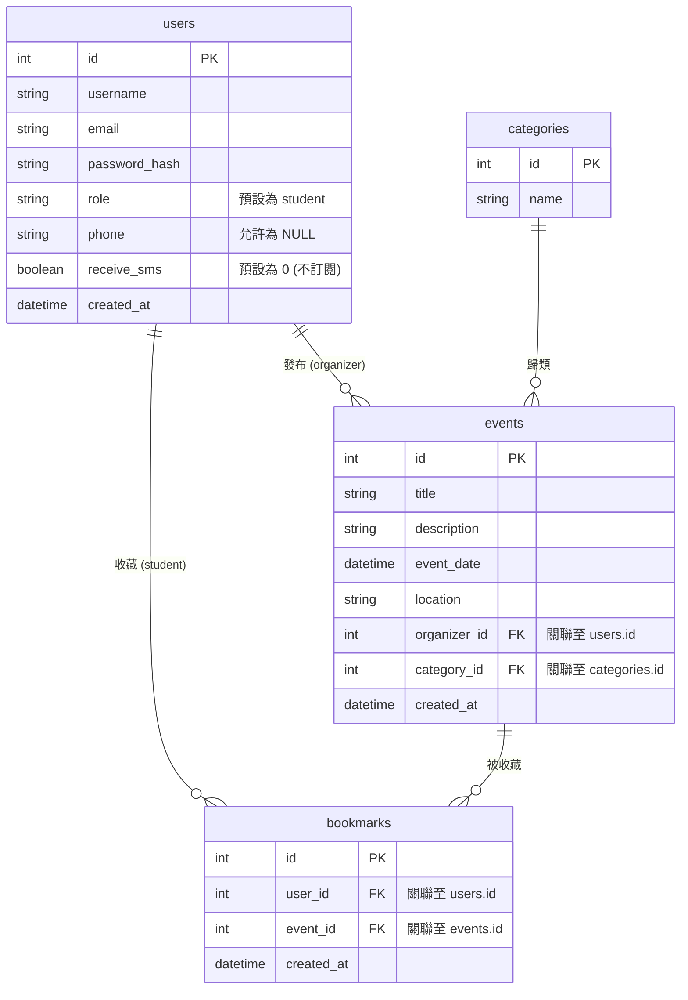

# 資料庫設計 (DB Design)

## 1. ER 圖 (實體關係圖)

以下圖表展示了校園活動資訊整合平台核心的資料表與彼此間的關聯：

---

## 2. 資料表詳細說明

### 2.1 users (使用者)
儲存一般學生與活動主辦單位的帳號資訊。
- `id` (INTEGER): Primary Key, 自動遞增。
- `username` (VARCHAR(50)): 必填，使用者暱稱或組織名稱。
- `email` (VARCHAR(120)): 必填，唯一值，作為登入帳號。
- `password_hash` (VARCHAR(256)): 必填，加密後的密碼。
- `role` (VARCHAR(20)): 使用者身分，預設為 `student`，主辦單位可為 `organizer`。
- `phone` (VARCHAR(20)): 選填，使用者聯絡手機，用於簡訊通知。
- `receive_sms` (BOOLEAN): 是否訂閱簡訊通知，預設為 0 (代表不訂閱)。
- `created_at` (DATETIME): 帳號建立時間。

### 2.2 categories (活動分類)
儲存系統中可用的活動分類，供搜尋與過濾使用。
- `id` (INTEGER): Primary Key, 自動遞增。
- `name` (VARCHAR(50)): 必填，唯一值，分類名稱（例如：學術講座、體育競賽）。

### 2.3 events (活動資訊)
儲存各項活動的詳細資訊。
- `id` (INTEGER): Primary Key, 自動遞增。
- `title` (VARCHAR(150)): 必填，活動標題。
- `description` (TEXT): 必填，活動內容說明。
- `event_date` (DATETIME): 必填，活動預定舉辦時間。
- `location` (VARCHAR(150)): 必填，活動舉辦地點。
- `organizer_id` (INTEGER): 必填，Foreign Key 對應到 `users.id`。
- `category_id` (INTEGER): 必填，Foreign Key 對應到 `categories.id`。
- `created_at` (DATETIME): 活動資料建立時間。

### 2.4 bookmarks (活動收藏)
紀錄一般學生收藏了哪些活動。
- `id` (INTEGER): Primary Key, 自動遞增。
- `user_id` (INTEGER): 必填，Foreign Key 對應到 `users.id`。
- `event_id` (INTEGER): 必填，Foreign Key 對應到 `events.id`。
- `created_at` (DATETIME): 收藏加入時間。

---

## 3. SQL 建表語法
完整的建表語法請參考專案目錄中的 `database/schema.sql` 檔案。

## 4. Python Model 程式碼
基於架構文件中的技術選型，我們使用 SQLAlchemy 來實作 Python Model，詳細程式碼請見 `app/models.py`。
