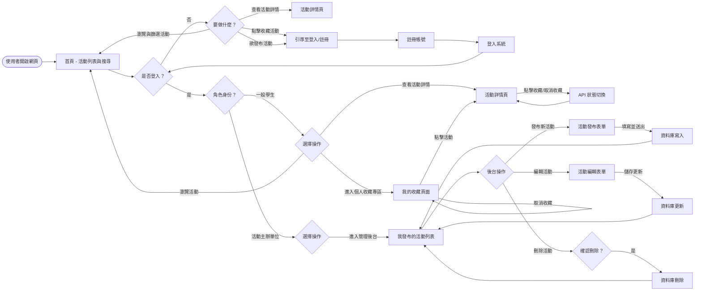
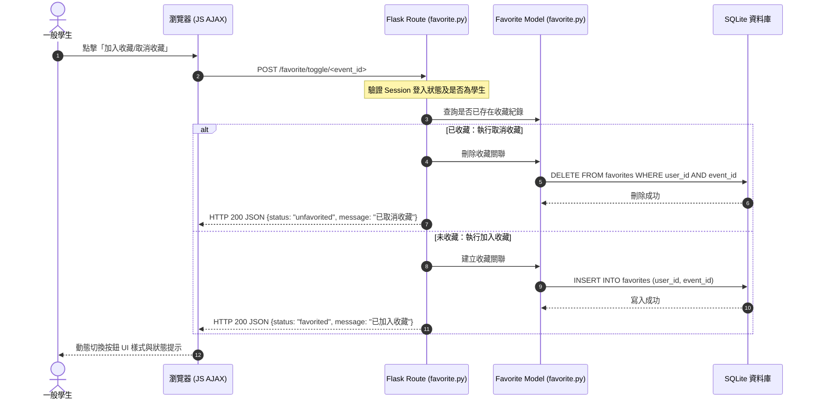
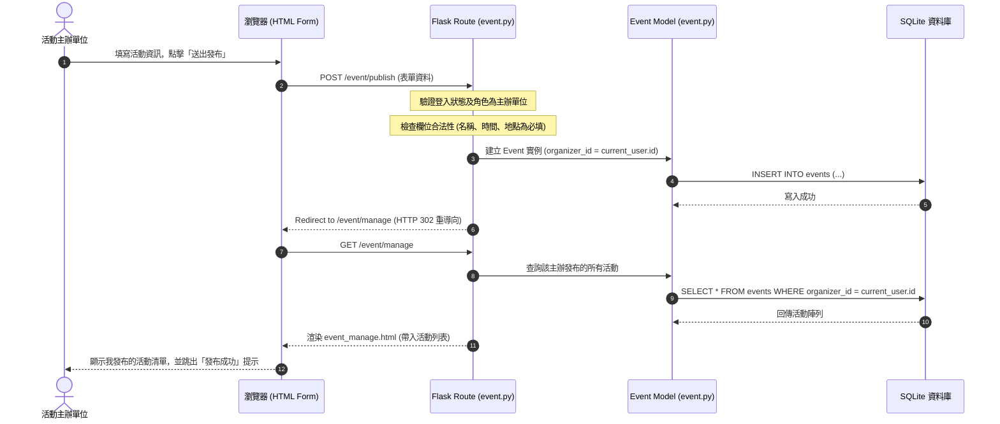

# 使用者與系統流程圖文件 (Flowcharts & Sequence Diagrams)

本文件描述「校園活動資訊整合平台」的使用者操作流程（User Flow）、系統資料流向（Sequence Diagram）以及對應的路由與 API 規劃。

---

## 1. 使用者流程圖 (User Flow)

此圖描述一般訪客、學生與主辦單位在平台上的操作路徑。

---

## 2. 系統序列圖 (Sequence Diagram)

以下是本專案主要分工功能的系統資料流向。

### 2.1 活動收藏功能序列圖 (AJAX 異步處理)
描述學生點擊「收藏/取消收藏」到資料庫更新並回傳的流程。

### 2.2 活動發布與管理序列圖 (Form 表單提交)
描述活動主辦單位填寫表單發布活動至後台列表呈現的流程。

---

## 3. 功能清單與路由對照表

本平台的路由設計如下，這也是後續開發路由 Skeleton 的基礎：

| 功能模組 | 功能名稱 | URL 路徑 | HTTP 方法 | 限制權限 | 說明 |
| :--- | :--- | :--- | :--- | :--- | :--- |
| **Auth** (認證) | 使用者註冊 | `/auth/register` | GET, POST | 無 | 處理一般學生與主辦單位的註冊流程。 |
| | 使用者登入 | `/auth/login` | GET, POST | 無 | 驗證帳密並建立 Session。 |
| | 使用者登出 | `/auth/logout` | POST | 需登入 | 清除 Session 並重導向至首頁。 |
| **Main** (瀏覽) | 首頁活動列表 | `/` | GET | 無 | 顯示活動，支援分類篩選與關鍵字搜尋。 |
| | 活動詳細頁 | `/event/detail/<int:event_id>` | GET | 無 | 展示活動的時間、地點、詳情與報名連結。 |
| **Favorite** (收藏) | 收藏切換 (AJAX) | `/favorite/toggle/<int:event_id>` | POST | 學生 | 切換收藏狀態（自動判斷新增或刪除）。 |
| | 我的收藏清單 | `/favorite/my-favorites` | GET | 學生 | 顯示當前學生帳號已收藏的活動列表。 |
| **Event** (管理) | 發布活動頁面 | `/event/publish` | GET, POST | 主辦單位 | 填寫並發布新活動。 |
| | 主辦管理後台 | `/event/manage` | GET | 主辦單位 | 顯示該主辦帳號發布的所有活動。 |
| | 編輯活動頁面 | `/event/edit/<int:event_id>` | GET, POST | 主辦單位 (限擁有者) | 修改已發布活動的欄位資訊。 |
| | 刪除活動 | `/event/delete/<int:event_id>` | POST | 主辦單位 (限擁有者) | 下架並刪除該活動。 |
