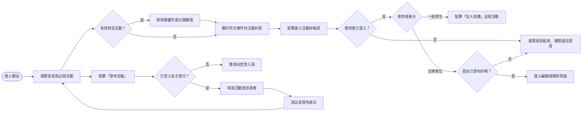
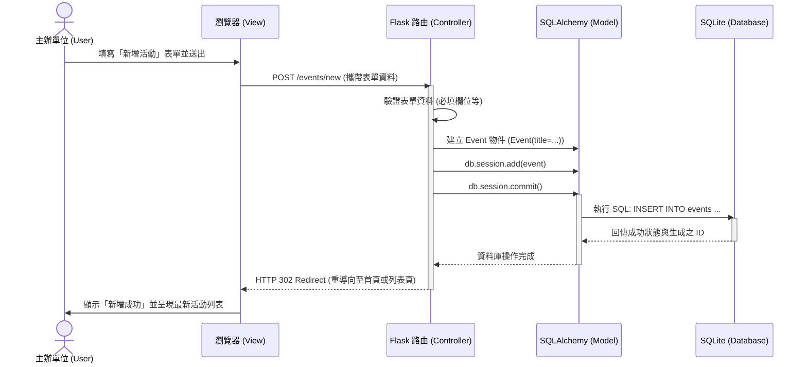

# 使用者流程與系統流程圖 (FLOWCHART)

## 1. 使用者流程圖 (User Flow)

此流程圖描述一般學生與主辦單位從進入網站開始的操作路徑與體驗。

---

## 2. 系統序列圖 (Sequence Diagram)

此序列圖描述「主辦單位新增活動」時，前端、後端與資料庫之間的資料傳遞流程。

---

## 3. 功能清單與路由對照表

本表列出系統預期實作之核心功能與對應的路由規劃。

| 功能名稱 | URL 路徑 | HTTP 方法 | 說明 |
| --- | --- | --- | --- |
| **首頁 / 近期活動** | `/` | GET | 顯示最新的活動精選與導覽列。 |
| **活動列表總覽** | `/events` | GET | 列出系統內所有的活動，預設依日期排序。 |
| **活動分類與搜尋** | `/events/search` | GET | 透過 Query Parameter (如 `?q=關鍵字` 或 `?category=講座`) 取得篩選結果。 |
| **活動詳細資訊** | `/events/<id>` | GET | 顯示指定活動的完整圖文、時間與地點。 |
| **新增活動頁面** | `/events/new` | GET | 顯示供主辦單位填寫的表單 (需驗證登入權限)。 |
| **送出新增活動** | `/events/new` | POST | 接收表單，將新活動寫入資料庫並重導向。 |
| **編輯活動頁面** | `/events/<id>/edit` | GET | 顯示活動編輯表單，預設帶入舊有資料。 |
| **更新活動資料** | `/events/<id>/edit` | POST | 將修改過的資料更新至資料庫。 |
| **刪除活動** | `/events/<id>/delete`| POST | 自資料庫移除指定活動 (為防誤觸，通常不直接使用 GET)。 |
| **會員註冊** | `/auth/register` | GET/POST | 顯示註冊表單與處理帳號建立邏輯。 |
| **會員登入** | `/auth/login` | GET/POST | 處理使用者登入並建立 Session。 |
| **會員登出** | `/auth/logout` | GET | 清除 Session 並回到首頁。 |
